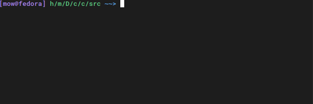

Welcome to Comp0010 Shell Python P14's documentation!
=====================================================

.. toctree::
   :maxdepth: 1
   :caption: Documentation
   :hidden:

   markdown/intro
   markdown/language
   markdown/applications
   markdown/interface

.. note::
   This shell was designed and developed by team-14-python for the
   COMP0010-Software engineering coursework, entirely for learning
   purposes. It is not intended to be practically usable.

Getting Started
===============

Installation
------------

To install all project dependencies run this from the root directory:

.. code:: bash
	  
   $ python -m pip install -r requirements.txt

Running
-------

From the root directory run:

.. code:: bash

   $ python src/run.py

or:

.. code:: bash

   $ bash sh

Here you go! You can now play around with our **shell**.

Original Documentation
----------------------

As a part of our assignment we were given the documentation that our shell had to follow.
The following docs, defined grammar, minimal application suite and the command line interface
that our shell follows. You can see original documentation below.

- :doc:`markdown/intro`
- :doc:`markdown/language`
- :doc:`markdown/applications`
- :doc:`markdown/interface`

.. toctree::
   :maxdepth: 1
   :caption: Extra Functionality
         
   markdown/features

Some extra functionality we added to our shell.

         
.. toctree::
   :maxdepth: 1
   :caption: Development

   markdown/development

All development related information that will make it easier to understand our code base.

.. toctree::
   :maxdepth: 1
   :caption: Reference

   apidocs/shell
   apidocs/parser
   apidocs/run
   apidocs/prompt
   apidocs/apps
   apidocs/commands
   apidocs/exceptions
   apidocs/common
