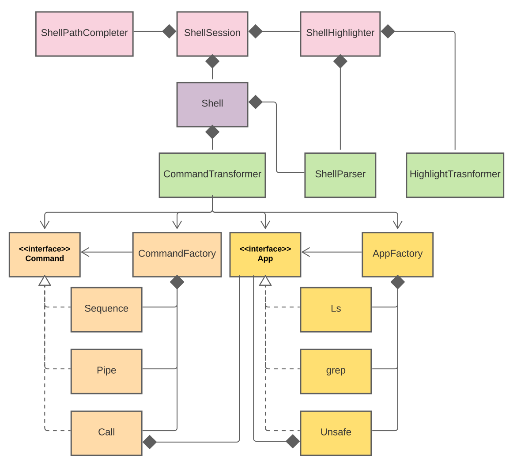
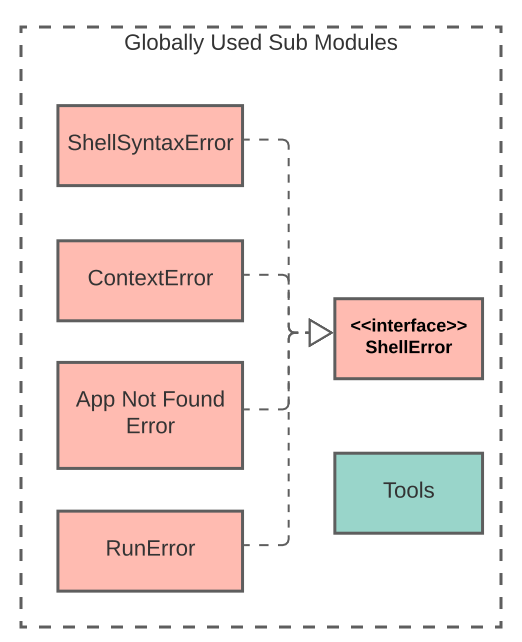

# Architecture

## Overview
Our design includes a total of 7 modules.

- Prompt
- Shell
- Parser
- Commands
- Apps
- Exceptions (Global)
- Common (Global)

The ones that we marked as `Global` can potentially be used
in any module.

## Main Modules

Here is the UML diagram for our main modules.

blah blah blah add some text here

## Global Modules

Exceptions and common.

blah blah blah add more text here.

# Testing

# Code style
