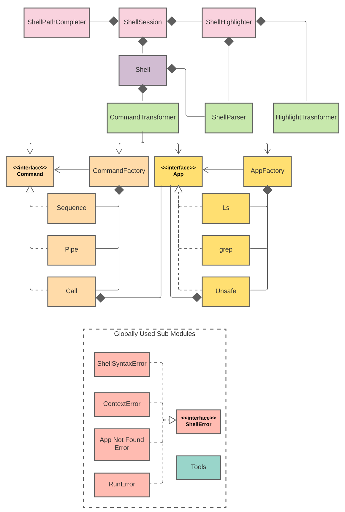

# Architecture

## Overview
Our design includes a total of 7 modules.

- Prompt
- Shell
- Parser
- Commands
- Apps
- Exceptions
- Common

# Testing

To run all tests written in `/test` from the `src` directory run:

	coverage run -m unittest discover ../test/

Write tests that hit 96% or higher coverage.

# Code style

* All code must conform to PEP8 standards.
* All modules, methods and classes should be documented with google style docstrings,
  an example of which can be found [here](https://gist.github.com/redlotus/3bc387c2591e3e908c9b63b97b11d24e).

## Linting
Run pylint

	pylint src

Run flake8

	flake8 src

## Formatting

Imports should be sorted with isort.

	isort src
	
Keep in mind that isort might cause circular import in `__init__`. Re-order imports as needed.

Auto formatting can be done with tools like [YAPF](https://github.com/google/yapf).

	yapf -i -r src
	
Don't forget to format our testing directory

	yapf -i -r test
