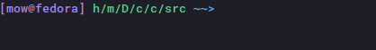
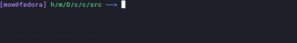
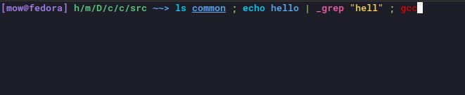

# Features Overview

The features listed in our specification for the development of the shell consisted of adding more applications, unsafe application variants, piping, redirecting, command substitution as well as general refactoring.

This section will highlight the additional features added to the shell that were not requested but we thought would make a more effective shell.

# Applications

These are additional commands that the original shell did not contain, allowing users to perform more tasks through their terminal.

## clear

Will remove all text from the terminal.

```
clear
```

## mkdir

Creates directories at the specified paths.

```
mkdir [PATH]...
```

* `PATH` represents the directory to be created.

## rm

Deletes empty directories and files.

```
rmd [OPTIONS] [PATH]...
```
* `PATH` represents the directory to be created.
* `OPTIONS`:
   * `-r` Recursively deletes items within a directory, then the directory itself.

# Extra Utility

Additions here are essentially quality of life changes, allowing users to make use of the shell in a more effective manner. All of these changes are easilly made possible by using PromptSession from `prompt_toolkit` library.

## Key Bindings

Our shell fully supports `Emacs` keybindings by default.

- Ctrl-p - up arrow
- Ctrl-n - down arrow
- Ctrl-a - go to beginning of the line
- Ctrl-e - go to the end of the line
- Ctrl-k - kill everything to the right of the cursor

and more...

## Command Buffer



Just like any normal shell, our shell has a command buffer!
You can navigate through the history of previosly ran
commands using arrow keys

## Text Completion



Pressing tab while typing a command in the Comp0010 Shell will automatically insert valid paths.

## Syntax Highlighting



By combining features from `lark` and `prompt_toolkit` libraries we were able to come up with
contextual syntax highlighting for our shell.

* It will only highlight the app, if our shell recognises it.
  In case our shell is not aware of the app, it will highlight it red.

* Unsafe Apps are highlighted differently to normal apps.

* If an argument to a command is an existing path, it will get underlined.

* If it detects that the syntax of the currently typed command is incorrect the whole input
  will get highlighted red.

* It also highlights quotations pipes and sequences.

